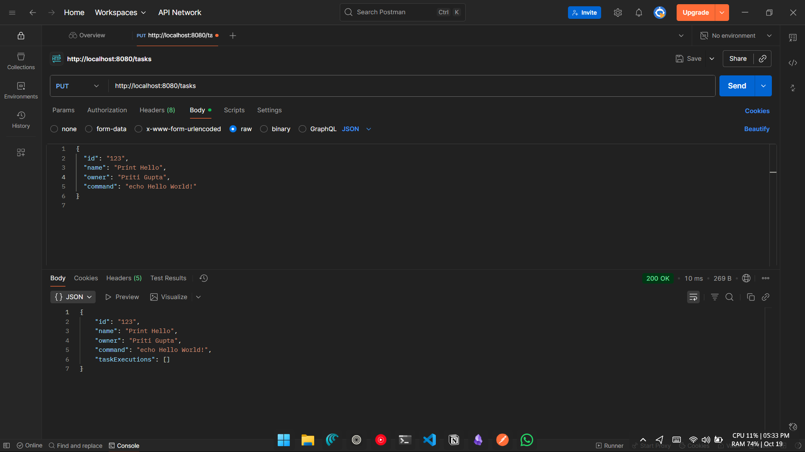
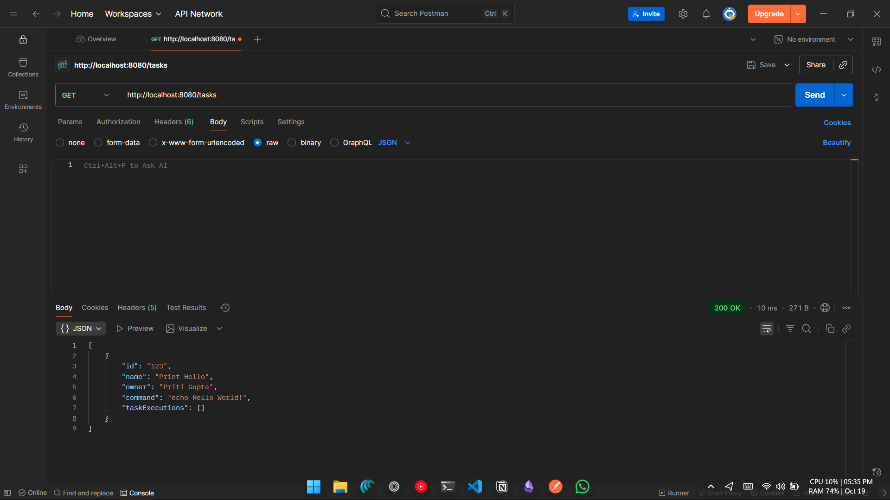
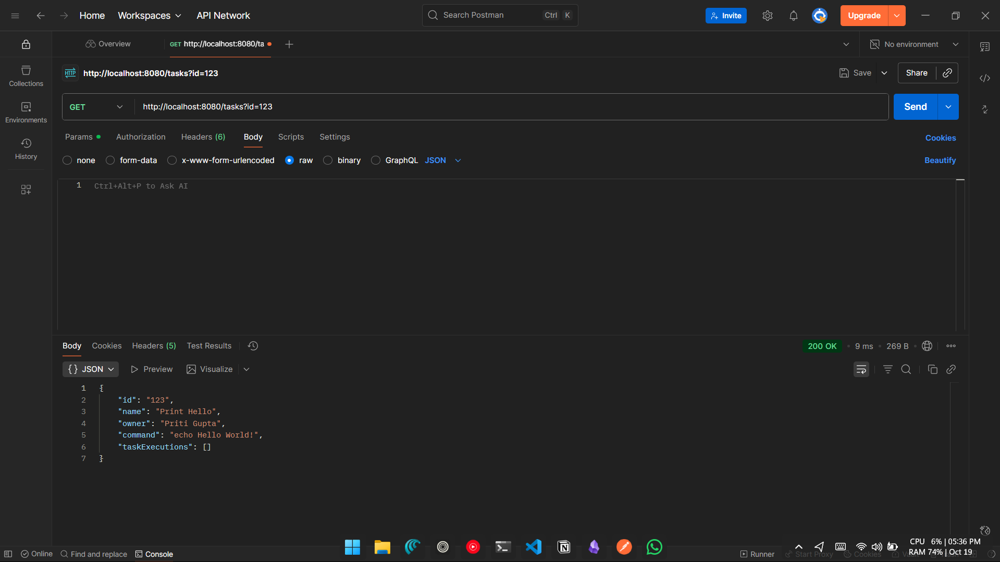
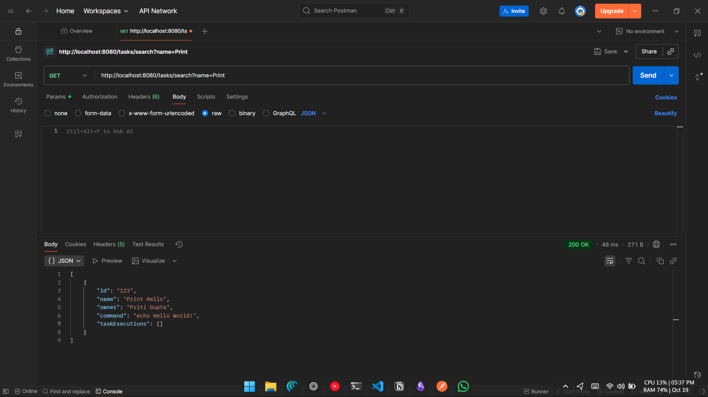
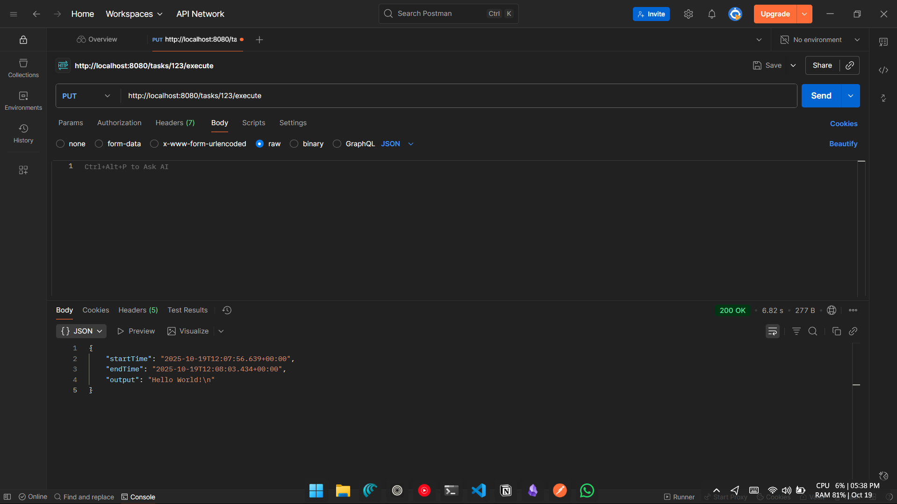
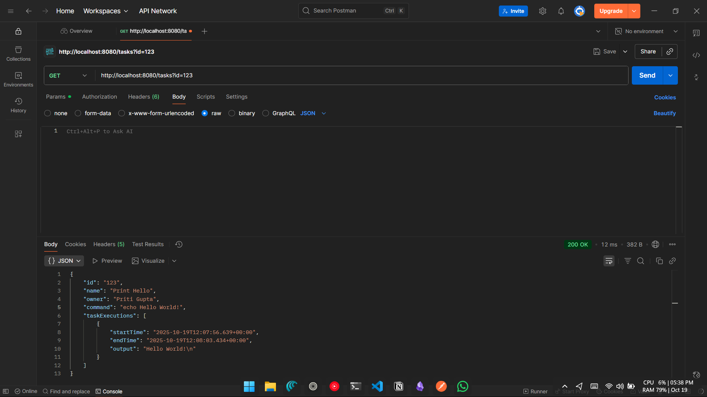
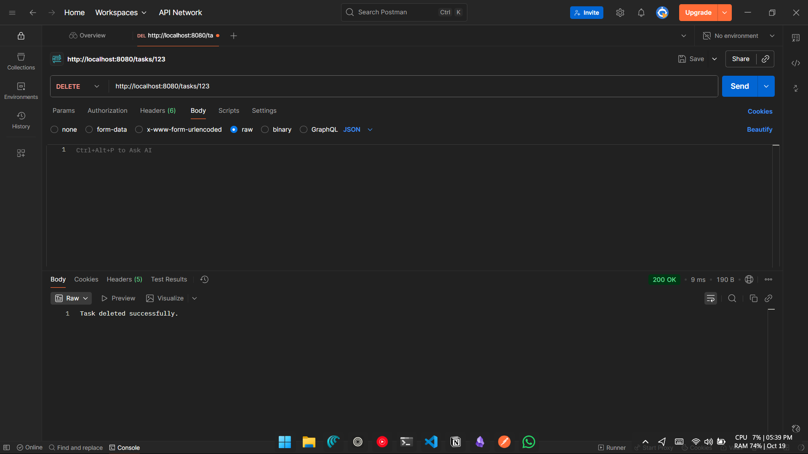

# Task Manager Backend

## Project Overview
This project is a **Java Spring Boot REST API** for managing "Task" objects stored in **MongoDB**.  
Each task represents a shell command that can be executed, and execution history is tracked.

The API supports:
- Creating, updating, deleting tasks
- Searching tasks by name
- Executing tasks and recording output

---

## Features
- CRUD operations for tasks
- Task execution with start/end timestamps and output
- MongoDB persistence
- Safe command validation to prevent malicious execution
- JSON-based REST API

---

## Tech Stack
- **Backend:** Java 17+, Spring Boot 3.x
- **Database:** MongoDB
- **Build Tool:** Maven
- **Libraries:** Spring Web, Spring Data MongoDB

---

## Project Structure

```

task-manager-backend/
├── src/
│   ├── main/
│   │   ├── java/com/kaiburr/taskmanager/
│   │   │   ├── controller/        # REST controllers
│   │   │   ├── model/             # Task & TaskExecution classes
│   │   │   ├── repository/        # MongoDB repositories
│   │   │   └── TaskManagerApplication.java
│   │   └── resources/
│   │       └── application.properties
├── pom.xml
├── README.md
└── screenshots/                    # Screenshots of API requests

```

---

## Prerequisites
1. **Java 17+**
2. **Maven**
3. **MongoDB running locally** at `mongodb://localhost:27017/taskdb`

---

## Setup Instructions

1. **Clone the repository:**
```bash
git clone https://github.com/priti200/task-manager-backend.git
cd task-manager-backend
```

2. **Run MongoDB:**

```bash
# Windows
net start MongoDB

# macOS
brew services start mongodb-community

# Linux
sudo systemctl start mongod
```

3. **Run the Spring Boot application:**

```bash
mvn spring-boot:run
```

4. **Test API endpoints** using Postman or curl.

---

## API Endpoints

| Method | URL                           | Description                              |
| ------ | ----------------------------- | ---------------------------------------- |
| GET    | `/tasks`                      | Get all tasks                            |
| GET    | `/tasks?id={taskId}`          | Get task by ID                           |
| PUT    | `/tasks`                      | Create or update a task                  |
| DELETE | `/tasks/{taskId}`             | Delete task by ID                        |
| GET    | `/tasks/search?name={string}` | Search tasks by name substring           |
| PUT    | `/tasks/{taskId}/execute`     | Execute task command and store execution |

---

### Example Task JSON

```json
{
  "id": "123",
  "name": "Print Hello",
  "owner": "John Smith",
  "command": "echo Hello World!"
}
```

---

## Screenshots

### 1. Create / Update Task


### 2. Get All Tasks


### 3. Get Task based on ID no.


### 4. Get Task based on Name


### 5. Task Execution



### 6. Delete Task

---
